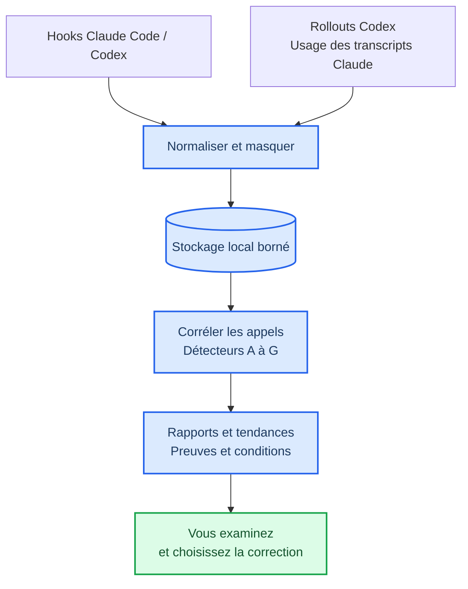
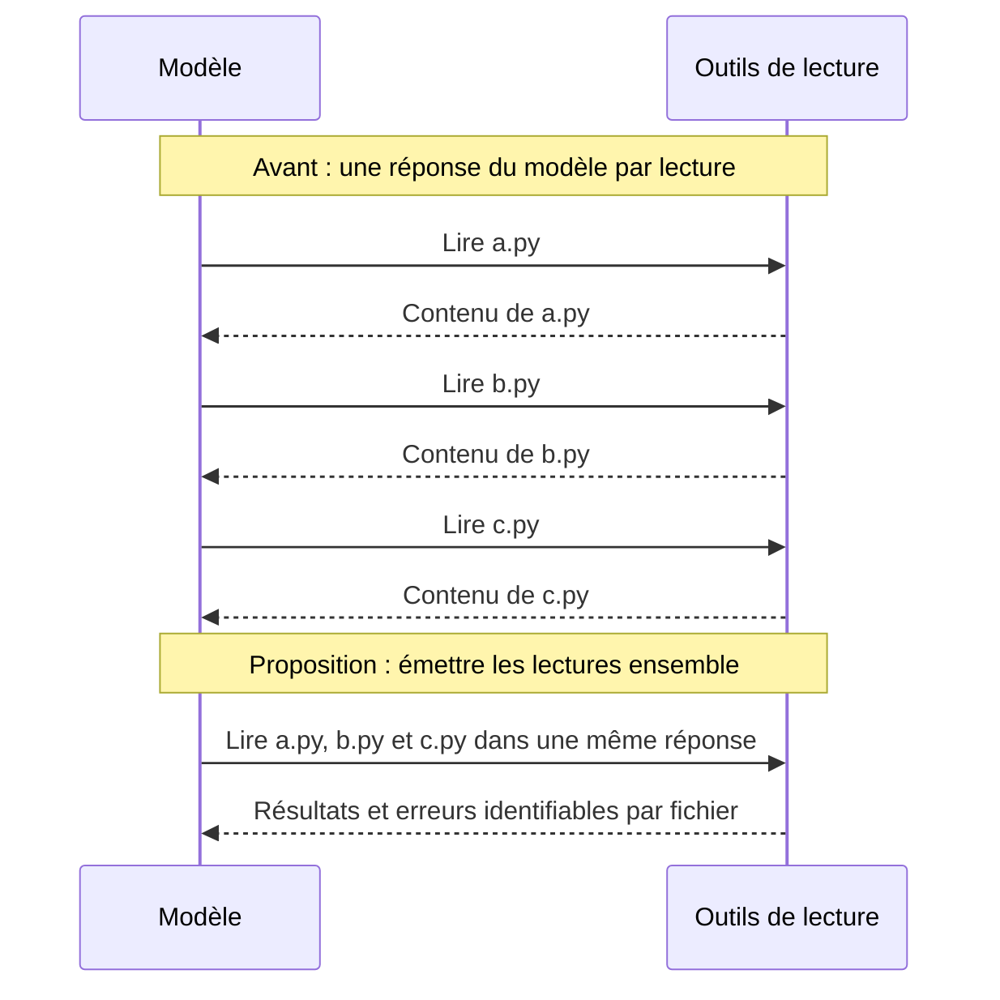
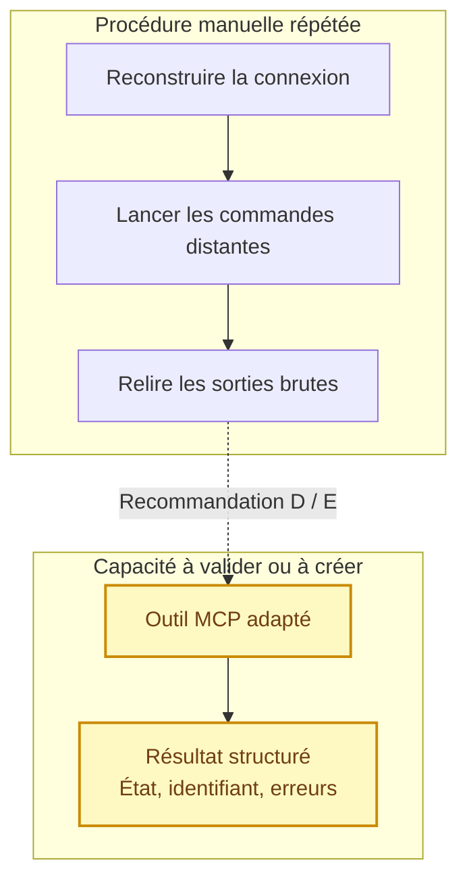
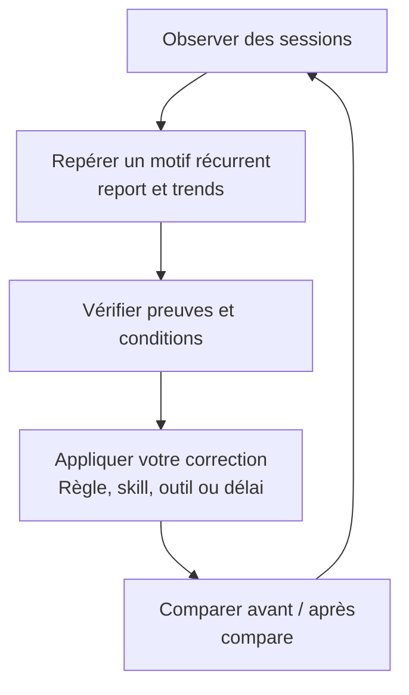

# AgentWatch

> **WIP — projet en cours de développement.** Les fonctionnalités, les formats de rapport et la documentation peuvent encore évoluer.

_Comprendre où vos agents de code refont du travail, puis vérifier que vos corrections améliorent leurs sessions._

**AgentWatch** est un observateur local et passif pour **Claude Code** et **Codex**. Il repère les relectures inutiles, les boucles d'erreurs, les attentes trop fréquentes et les procédures répétées qui pourraient être regroupées ou mieux outillées.

L'objectif : préserver les tokens, le temps et le contexte du modèle en s'appuyant sur les traces réelles de ses sessions. Chaque signalement explique ce qui a été observé, ce qui pourrait le remplacer et ce qu'il faut vérifier avant de changer le fonctionnement.

| Clients | Exécution | Analyse | Restitution |
|---|---|---|---|
| Claude Code · Codex | Python 3.11+ · locale | 7 détecteurs déterministes | Rapports Markdown / JSON |
| Hooks et journaux natifs | Bibliothèque standard par défaut | Aucun second LLM | Terminal, HTML / SVG en option |

> **À retenir :** AgentWatch aide à corriger les pratiques des agents. Il ne corrige pas le code du projet, n'interrompt pas les agents et n'applique aucune de ses recommandations automatiquement.

[Problèmes et corrections](#-quels-problèmes-agentwatch-aide-à-corriger) · [Exemples visuels](#-voir-les-corrections-en-pratique) · [Démarrage](#-démarrer) · [Rapports](#-lire-les-rapports) · [Documentation](#-documentation)

---

## 🎯 Quels problèmes AgentWatch aide à corriger

Un agent peut terminer une tâche tout en relisant les mêmes fichiers, en réessayant une commande qui échoue ou en réveillant le modèle uniquement pour constater qu'un calcul est encore en cours. Ces opérations ajoutent des commandes à construire et des sorties à relire, sans toujours apporter une information nouvelle.

AgentWatch rend ces motifs visibles et propose des corrections à valider :

| Détecteur | Problème observé | Correction proposée |
|---|---|---|
| **A — Travail refait** | Même fichier relu via `Read`, `cat` ou `Get-Content` ; recherche, test ou build relancé sans changement observé | Réutiliser un résultat encore valide ; cibler une vérification nécessaire ; vérifier la justification d'une relance |
| **B — Boucles d'erreurs** | Même échec répété sans correction observable, parfois malgré des entrées différentes | Diagnostiquer la cause avant de réessayer ; adapter la procédure ou la stratégie de reprise |
| **C — Opérations regroupables** | Lectures de plusieurs cibles émises dans des réponses successives du modèle | Émettre ensemble les appels indépendants, ou utiliser un outil acceptant plusieurs cibles |
| **D — Automatisation candidate** | Séquence récurrente dont certaines étapes sont mécaniques | Valider une recette de script, de skill ou d'outil ; conserver les étapes qui exigent un jugement |
| **E — Capacité structurée manquante** | Service externe manipulé par plusieurs commandes `ssh`, SLURM, `curl`, `gh`, cloud ou Docker | Utiliser un outil MCP adapté, ou préciser la capacité à créer et son contrat |
| **F — Consignes répétées** | Instructions redonnées manuellement par l'utilisateur ou l'orchestrateur dans les rollouts Codex | Envisager une règle de projet ou une skill réutilisable, sans en déduire une économie automatique |
| **G — Répétitions et attentes** | Appels répétés pour attendre, réessayer ou relire un état inchangé | Ajuster la cadence, utiliser une attente bloquante ou allonger une attente existante lorsque son contrat le permet |

Les détecteurs tiennent compte des changements, des erreurs, des agents et des compactions connus. Une relecture après modification, une pagination différente ou une information réellement nouvelle peuvent justifier un nouvel appel. Les règles, seuils et contre-exemples sont détaillés dans [le guide des détecteurs](docs/detectors.md).

Le bénéfice recherché est du **contexte utile** : moins de résultats redondants à relire, moins de procédures à reconstruire et des interactions plus explicites avec les outils. Les économies effectives doivent ensuite être mesurées.

## 🔍 Comment cela fonctionne

AgentWatch collecte des événements par les hooks des clients ou lit les journaux existants. Il les normalise, rapproche les débuts et fins d'appels, puis analyse les sessions localement.



L'analyse reconnaît des **unités de travail**, pas seulement des commandes identiques. Par exemple, `Read src/a.py` et `cat src/a.py` peuvent correspondre à la même lecture. Une empreinte du résultat permet de constater une égalité de contenu sans conserver le fichier en clair dans la collecte standard.

Les commandes non reconnues restent explicitement inconnues : AgentWatch ne prétend pas comprendre arbitrairement toutes les commandes shell. Voir [l'architecture](docs/architecture.md) et [le schéma des événements](docs/events.md).

## 💡 Voir les corrections en pratique

Les schémas ci-dessous sont des **illustrations de recommandations**, pas des mesures de gains ni des corrections exécutées par AgentWatch.

### Regrouper des lectures indépendantes

Si la liste des fichiers est déjà connue, demander au modèle de reprendre après chaque lecture peut ajouter des allers-retours évitables. Le détecteur C propose de les émettre ensemble.



**Conditions :** cibles connues au départ, lectures indépendantes, volume compatible avec le contexte et résultats identifiables. Si le contenu de `a.py` détermine quel fichier lire ensuite, la lecture séquentielle reste nécessaire. Des appels déjà émis ensemble ne sont pas considérés comme des allers-retours supplémentaires, même si le client les exécute successivement.

### Remplacer une procédure manuelle par une capacité structurée

Un agent qui utilise régulièrement un calculateur distant peut reconstruire les mêmes étapes de connexion, de consultation et d'interprétation. Les détecteurs D et E aident à définir ce qu'un outil MCP ou une skill devrait exposer.



**Conditions :** mêmes opérations, droits, résultats, erreurs et effets. Un nom d'outil évocateur ne prouve ni sa disponibilité ni son équivalence. AgentWatch peut documenter un manque ; il ne construit pas le serveur MCP et n'exécute aucune commande proposée.

### Réduire les réveils sans information nouvelle

Le détecteur G distingue une attente, une indisponibilité, une modification, une compaction et une répétition sans cause observée. Pour chaque reprise, il examine aussi ce qui a réellement changé dans le résultat.

| Parcours illustratif | Interaction avec le modèle | Correction à examiner |
|---|---|---|
| Sondages courts | « En cours » → « En cours » → « En cours » → résultat | Cadence adaptée à l'urgence réelle |
| Attente bloquante | Un appel attend un changement ou atteint son délai maximal | Retourner l'état du même job, ses erreurs et son identifiant |
| Attente existante trop courte | L'agent relance plusieurs fois l'attente du même job | Allonger son délai si le contrat et la disponibilité de l'agent le permettent |

Les délais de réaction, erreurs, annulations et états nécessaires doivent être préservés. Une réduction du nombre d'appels n'établit pas à elle seule une baisse des tokens. Voir [les contrats de remplacement et d'attente](docs/replacements.md).

## 🚀 Démarrer

### Prérequis et lancement

Python **3.11 ou plus** et Claude Code et/ou Codex. Le fonctionnement de base utilise uniquement la bibliothèque standard, sans dépendance d'exécution à installer.

```bash
git clone https://github.com/Gotman08/agentwatch.git
cd agentwatch
python -m agentwatch --help
python -m agentwatch doctor
```

Exécutez les commandes suivantes depuis le dépôt. L'installation de la commande `agentwatch` est facultative : `python -m pip install -e .`. Les versions et plateformes effectivement vérifiées figurent dans [la matrice de compatibilité](docs/compatibility.md).

### Codex : commencer sans hooks

Par défaut, `sessions`, `report` et `trends` importent de façon incrémentale les rollouts de `~/.codex/sessions` (`rollouts.auto_import`). Ils sont lus en lecture seule : aucune configuration de Codex n'est nécessaire pour cette voie.

Après une session Codex :

```bash
python -m agentwatch sessions --client codex
python -m agentwatch report --client codex --latest --format markdown
```

Pour une lecture continue en arrière-plan, avec priorité réduite :

```bash
python -m agentwatch import-rollouts --follow
```

### Claude Code ou Codex : installer les hooks

Choisissez le client utilisé et examinez d'abord le diff :

```bash
python -m agentwatch configure --client claude-code --dry-run
python -m agentwatch configure --client codex --dry-run
```

Pour appliquer la configuration du client choisi :

```bash
python -m agentwatch configure --client claude-code --apply
# Ou, pour Codex :
python -m agentwatch configure --client codex --apply
```

Une sauvegarde automatique est créée. **Pour les hooks Codex**, approuvez ensuite l'entrée AgentWatch via `/hooks` ; sans cette approbation, le hook est ignoré. Cette étape concerne la collecte par hooks.

Après une session avec les hooks actifs :

```bash
python -m agentwatch sessions
python -m agentwatch report --latest --format markdown
```

Utilisez `--session <id>` pour une session précise et `--client` pour éviter de sélectionner celle d'un autre client. Les portées utilisateur/projet, réglages et commandes de désinstallation sont décrits dans [le guide d'installation](docs/installation.md).

## 📊 Lire les rapports

### Un diagnostic avec des preuves

Un signalement relie le problème à des appels précis. Il fournit le niveau de confiance et sa justification, le coût observé, les contre-indications, les données manquantes, la correction proposée et son protocole de validation.

Voici un aperçu reformulé de [l'exemple de rapport synthétique](examples/reports/session-synthetique.md), généré à partir d'une fixture et non d'une session réelle :

| Champ | Exemple synthétique |
|---|---|
| Problème | `src/a.py` lu 3 fois via `Read` et `Bash` |
| Détecteur | `A.redundant_reads` — travail refait entre outils |
| Preuve | Empreintes de contenu identiques ; même agent et même époque de contexte |
| Coût des relectures | 2 appels ; 193 octets observés ; tokens non mesurés |
| Proposition | Réutiliser le premier résultat s'il est encore valide et accessible |
| Limite | Le contexte réellement disponible et les modifications externes ne sont pas entièrement observables |

Une confiance `high` décrit la solidité heuristique du signalement ; elle n'est pas une probabilité calibrée et ne garantit pas que son remplacement soit applicable. Les préconditions des remplacements sont **établies**, **réfutées** ou **inconnues**. Voir [les remplacements sous conditions](docs/replacements.md).

### Choisir le format

```bash
python -m agentwatch report --latest --format markdown --out rapport.md
python -m agentwatch report --latest --format json --out rapport.json
python -m agentwatch report --latest --format json-refs --out rapport-refs.json
```

Le JSON classique est en version **1.1** ; `json-refs` fournit l'export **2.0**, avec structures partagées et références de preuve conservées. Un rapport peut aussi être limité à une journée (`--day AAAA-MM-JJ`) ou à une période (`--since`, `--until`).

Pour un terminal enrichi ou un rapport visuel exportable, installez l'option Rich :

```bash
python -m pip install -e ".[rich]"
python -m agentwatch report --latest --format rich
python -m agentwatch report --latest --format html --out rapport.html
python -m agentwatch report --latest --format svg --out rapport.svg
```

Ces exports sont des restitutions du rapport local ; le projet n'inclut pas d'interface web interactive.

### Trouver les motifs qui reviennent

```bash
python -m agentwatch trends --days 7
python -m agentwatch trends --days 7 --client codex --min-sessions 3
```

`trends` regroupe les signalements par motif stable et montre dans combien de sessions, de projets et de clients ils reviennent. Filtres utiles : `--project <texte>`, `--format json` et `--days 0` pour tout l'historique. Un motif récurrent donne une meilleure base pour décider d'une règle ou d'un outil qu'un incident isolé.

### Comprendre le contexte et la coordination

Pour Codex, le rapport décrit ce que les sorties d'outils ajoutent au contexte, leurs relectures avant et après compaction, les troncatures du client et les relevés d'usage disponibles. La section « Entre agents » rapproche les messages envoyés et reçus par empreinte, décrit les reprises consacrées aux messages et les ressources partagées. Ces vues restent descriptives, sans verdict sur l'utilité du travail.

Pour Claude Code, l'usage en tokens est importé à la demande :

```bash
python -m agentwatch import-transcripts --latest
```

Activez `transcripts.auto_import` dans `config.json` pour l'importer à chaque rapport. Les tokens sont issus des relevés du client ; les parts attribuées aux appels sont calculées. Les octets ne sont jamais convertis automatiquement en tokens et aucune donnée de facturation n'est lue.

<details>
<summary><strong>Inspection détaillée des sessions, compactions et runs</strong></summary>

`inspect` relit les journaux natifs en lecture seule, y compris les transcripts Claude Code sans hooks. L'export local peut contenir messages, arguments, résultats, erreurs, requêtes et références fichier/ligne. Les secrets sont masqués et le raisonnement est omis par défaut. Le client par défaut est Codex.

```bash
python -m agentwatch inspect --client claude-code --session <id> --since <instant> --until <instant> --format jsonl --out sequence.jsonl
python -m agentwatch claude-context --session <origine> --session <reprise> --out contexte.json
```

`claude-context` réunit les copies d'historique par identité de requête et reconstruit les fenêtres observées autour des compactions. Les totaux de transcripts de reprise ne doivent pas être additionnés comme des travaux indépendants. `inspect` propose aussi des filtres de type, rôle, texte et ligne source avant troncature. Voir [le contexte Claude](docs/claude-context.md).

Pour relier les notifications aux lectures d'un run, utilisez `inspect --client claude-code --session <id> --list-runs`, puis `--run <id> --field <champ> --fields-only`. `--through-line` fixe la frontière historique même lorsque les dates reculent ; un identifiant d'appel shell peut aussi servir de point de départ. Les liens non résolus restent explicites. Voir [l'inspection des runs](docs/run-inspection.md).

Contrairement à la collecte standard, les exports détaillés peuvent contenir du texte en clair : relisez-les avant de les partager.

</details>

---

## 🔧 Passer du signalement à une correction vérifiée

Une recommandation devient utile lorsqu'elle conduit à une modification concrète, puis à une comparaison sur des tâches comparables.



1. Examinez les appels concernés et les limites du signalement.
2. Vérifiez que le problème revient avec `trends`.
3. Choisissez une correction : résultat réutilisé, appels regroupés, procédure structurée, règle de projet ou attente adaptée.
4. Appliquez-la vous-même, puis observez de nouvelles sessions.
5. Comparez les périodes et marquez les signalements pertinents ou les faux positifs.

Exemple de comparaison autour d'un instant de correction, à remplacer par le vôtre :

```bash
python -m agentwatch compare --at 2026-10-05T14:00 --client codex
```

`compare` rapporte les mesures à l'activité et expose l'incertitude ; avec trop peu de données, il ne conclut pas à un gain démontré. Des tâches différentes peuvent expliquer un écart : la comparaison ne prouve pas à elle seule que votre correction en est la cause. Il est aussi possible d'enregistrer une référence (`--save-reference`) ou de comparer autour d'une version d'`AGENTS.md` (`--at agents-md:<empreinte>`). Voir [les commandes de comparaison](docs/installation.md#commandes).

## 🔒 Confidentialité, limites et santé de la collecte

- **Local :** AgentWatch n'envoie aucune donnée sur le réseau. Le stockage est borné et son dossier par défaut est `~/.agentwatch`, configurable via `AGENTWATCH_HOME` ou `--home`.
- **Collecte limitée :** champs autorisés, commandes masquées et empreintes HMAC locales. Les contenus de fichiers, prompts et sorties complètes ne sont pas conservés en clair par défaut dans la collecte standard. L'inspection détaillée est une voie distincte, sur demande.
- **Passif :** aucune modification des appels, aucun blocage, aucun retour automatique au modèle et aucune exécution des recommandations. Les hooks ajoutent néanmoins une surcharge mesurable ; la voie rollouts lit les journaux locaux.
- **Incertitudes explicites :** journaux incomplets, modifications externes et disponibilité réelle d'un résultat dans le contexte peuvent rester inconnus. Un appel répété n'est pas automatiquement inutile.
- **Masquage heuristique :** relisez les exports avant de les partager ; un secret d'une forme inconnue peut échapper au masquage. Ne partagez pas la clé HMAC locale.

`doctor`, `sessions`, `report` et `trends` avertissent lorsque la collecte paraît cassée : interpréteur disparu, dépôt déplacé, hooks retirés ou activité du client sans événement reçu. Après avoir déplacé le dépôt ou changé d'interpréteur, relancez `configure` pour mettre à jour les chemins des hooks.

Le périmètre comprend sept détecteurs, des rapports par session et multi-sessions, les mesures de contexte et de coordination disponibles, l'inspection locale et la comparaison avant/après. Aucun second LLM, embedding ou profilage Unreal n'est utilisé. Voir [la confidentialité](docs/privacy.md) et [les preuves de compatibilité et de surcharge](docs/compatibility.md).

## 🧪 Vérifier et contribuer

Depuis le dépôt :

```bash
python -m unittest discover -s tests -t .
python -m agentwatch self-test
```

`self-test` utilise des scénarios synthétiques et un hook réel lancé en sous-processus. La [matrice de compatibilité](docs/compatibility.md) distingue ce qui est documenté, testé sur fixture, vérifié réellement ou indisponible.

Pour signaler un problème, ouvrez une [issue](https://github.com/Gotman08/agentwatch/issues) avec le client, sa version et un cas reproductible expurgé de secrets. Les modifications peuvent être proposées par pull request.

## 📚 Documentation

| Guide | Ce que vous y trouverez |
|---|---|
| [Installation](docs/installation.md) | Commandes, portées, réglages et désinstallation |
| [Détecteurs](docs/detectors.md) | Règles A–G, seuils, confiance, exemples et contre-exemples |
| [Remplacements](docs/replacements.md) | Contrats, préconditions, attentes, sensibilité et exports JSON |
| [Architecture](docs/architecture.md) | Sous-systèmes, persistance et corrélation |
| [Événements](docs/events.md) | Schéma commun, paramètres conservés et import d'usage |
| [Compatibilité](docs/compatibility.md) | Versions vérifiées, matrice de preuve, surcharge et limites |
| [Confidentialité](docs/privacy.md) | Masquage, empreintes HMAC et champs autorisés |
| [Contexte Claude](docs/claude-context.md) | Requêtes uniques, reprises et compactions |
| [Inspection des runs](docs/run-inspection.md) | Notifications, champs, frontières historiques et rejeux |
| [Rapport synthétique](examples/reports/session-synthetique.md) | Exemple complet de signalements et de preuves |
